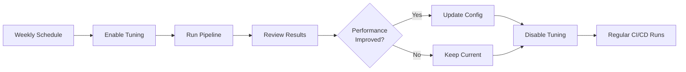

# Hyperparameter Tuning Guide

## Overview

This project implements **Pattern B (Conditional Tuning)** - a best practice approach where hyperparameter tuning can be enabled/disabled via configuration without changing code.

## Quick Start

### 1. Enable Tuning

Edit `config/config.yaml`:

```yaml
sagemaker:
  tuning:
    enabled: true        # Enable tuning
    phase: exploration   # Use wide search ranges
    max_jobs: 15
    max_parallel_jobs: 2
```

### 2. Run Pipeline

```bash
# Commit and push (triggers GitHub Actions)
git add config/config.yaml
git commit -m "Enable hyperparameter tuning"
git push origin main

# Or run locally
python pipelines/training_pipeline.py --environment dev
```

### 3. Monitor Tuning Job

Go to [SageMaker Console](https://console.aws.amazon.com/sagemaker/) → **Hyperparameter tuning jobs**

Watch the job progress and view:
- Best trial performance
- Parameter exploration patterns
- Training time per trial
- Convergence analysis

### 4. Retrieve Best Hyperparameters

After tuning completes, check the pipeline logs or use AWS CLI:

```bash
# Get tuning job name from SageMaker Console
aws sagemaker describe-hyper-parameter-tuning-job \
  --hyper-parameter-tuning-job-name <JOB_NAME> \
  --query 'BestTrainingJob'
```

### 5. Update Config with Best Values

Edit `config/config.yaml`:

```yaml
model:
  hyperparameters:
    max_depth: 6        # Update from tuning results
    eta: 0.25           # Update from tuning results
    gamma: 3.5          # Update from tuning results
    min_child_weight: 5 # Update from tuning results
    subsample: 0.75     # Update from tuning results
    colsample_bytree: 0.8
```

### 6. Disable Tuning for Regular Runs

```yaml
sagemaker:
  tuning:
    enabled: false  # Back to standard training
```

---

## Best Practices

### When to Use Tuning

✅ **DO use tuning when:**
- Initial model development (finding baseline)
- Significant data distribution changes detected
- New features added to the model
- Model performance degrades over time
- Moving between environments (dev → staging → production)
- Quarterly optimization reviews

❌ **DON'T use tuning when:**
- Every CI/CD pipeline run (too expensive)
- Model performs well and is stable
- Quick iterations during debugging
- No significant data or feature changes

### Tuning Phases

#### Phase 1: Exploration (Initial Discovery)

```yaml
tuning:
  phase: exploration
  max_jobs: 15-20
  max_parallel_jobs: 2
```

**Purpose:** Cast a wide net to find promising regions

**Parameter Ranges (Wide):**
- `max_depth`: 3-12
- `eta`: 0.01-0.5
- `gamma`: 0-5
- `min_child_weight`: 1-10
- `subsample`: 0.5-1.0
- `colsample_bytree`: 0.5-1.0

**When to use:** First time tuning, or after major data/feature changes

#### Phase 2: Optimization (Fine-Tuning)

```yaml
tuning:
  phase: optimization
  max_jobs: 10-15
  max_parallel_jobs: 2
```

**Purpose:** Narrow search around known good values

**Parameter Ranges (Narrow):**
- `max_depth`: 4-7
- `eta`: 0.1-0.3
- `gamma`: 2-6
- `min_child_weight`: 4-8
- `subsample`: 0.6-0.8
- `colsample_bytree`: 0.7-0.9

**When to use:** After exploration phase identifies promising region

### Cost Management

#### Development (Save Money)

```yaml
tuning:
  max_jobs: 5-10
  max_parallel_jobs: 1
  strategy: Random  # Faster than Bayesian for few jobs
```

**Cost:** ~$0.20-0.40 per tuning run
**Time:** ~25-50 minutes (sequential)

#### Production (Optimize Performance)

```yaml
tuning:
  max_jobs: 15-30
  max_parallel_jobs: 2-3
  strategy: Bayesian
```

**Cost:** ~$0.50-1.00 per tuning run
**Time:** ~15-30 minutes (parallel)

#### Research (Maximum Exploration)

```yaml
tuning:
  max_jobs: 50-100
  max_parallel_jobs: 5-10
  strategy: Bayesian
```

**Cost:** ~$1.50-3.00 per tuning run
**Time:** ~10-20 minutes (highly parallel)

### Strategy Selection

| Strategy | Best For | Pros | Cons |
|----------|----------|------|------|
| **Bayesian** | 10-100 jobs, continuous params | Smart exploration, learns from previous trials | Slower initial trials |
| **Random** | <10 jobs, quick baseline | Simple, unbiased | No learning between trials |
| **Grid** | Few discrete parameters only | Exhaustive coverage | Extremely expensive |

**Recommendation:** Use Bayesian for production tuning

### Early Stopping

Early stopping is **automatically enabled** and saves ~30-50% of training time/cost.

```yaml
model:
  hyperparameters:
    early_stopping_rounds: 10  # Stop if no improvement after 10 rounds
```

Benefits:
- Faster tuning jobs
- Lower costs
- Automatic convergence detection
- No impact on final model quality

---

## Parameter Priority Guide

### High-Impact Parameters (Tune First)

1. **`max_depth`** (3-12)
   - Controls model complexity
   - Biggest impact on overfitting/underfitting
   - **Always tune this**

2. **`eta`** (0.01-0.5) - Learning rate
   - Controls training speed
   - Lower = better generalization but slower
   - **Always tune this**

### Regularization Parameters (Tune Second)

3. **`gamma`** (0-5) - Minimum loss reduction
   - Controls tree splitting
   - Higher = more conservative

4. **`min_child_weight`** (1-10)
   - Controls minimum instance weight
   - Higher = more conservative

### Sampling Parameters (Tune Third)

5. **`subsample`** (0.5-1.0) - Row sampling
   - Prevents overfitting
   - Recommended: 0.6-0.8

6. **`colsample_bytree`** (0.5-1.0) - Column sampling
   - Prevents overfitting
   - Recommended: 0.6-0.9

### L1/L2 Regularization (Optional)

7. **`alpha`** (0-2) - L1 regularization
8. **`lambda`** (0-2) - L2 regularization

**Strategy:** Focus on parameters 1-6 first. Only tune alpha/lambda if overfitting persists.

---

## Objective Metric Selection

### For Diabetes Classification (Current)

```yaml
objective_metric: "validation:auc"
```

**Why AUC?**
- Handles class imbalance well
- Single threshold-independent metric
- Industry standard for medical classification

### Alternatives

| Metric | When to Use | Pros | Cons |
|--------|-------------|------|------|
| `validation:auc` | **Default** (recommended) | Imbalance-robust, threshold-free | May not reflect specific threshold needs |
| `validation:aucpr` | Extreme imbalance (>10:1) | Better for rare events | Less interpretable |
| `validation:error` | Balanced classes only | Simple, intuitive | Fails with imbalance |
| `validation:logloss` | Probability calibration needed | Good for well-calibrated probabilities | Harder to interpret |

---

## Troubleshooting

### Issue: Tuning jobs fail immediately

**Cause:** Resource limits or invalid hyperparameter ranges

**Solution:**
1. Check CloudWatch logs for specific errors
2. Verify instance type availability in region
3. Ensure hyperparameter ranges are valid

### Issue: No improvement across trials

**Cause:** Ranges too narrow or data issues

**Solutions:**
1. Switch to `phase: exploration` for wider ranges
2. Check data quality and preprocessing
3. Increase `max_jobs` for more exploration
4. Verify metric is logged correctly in training script

### Issue: High cost but poor results

**Cause:** Too many parallel jobs or poor strategy

**Solutions:**
1. Reduce `max_parallel_jobs` to 2-3
2. Use `strategy: Bayesian` instead of Random
3. Start with fewer `max_jobs` (10-15)
4. Enable early stopping (already default)

### Issue: Tuning results not visible in pipeline

**Cause:** Logging configuration

**Solution:** Check pipeline execution logs:
```bash
aws sagemaker list-pipeline-executions \
  --pipeline-name diabetes-classification-pipeline \
  --region us-east-1
```

---

## Integration with CI/CD

### Recommended Workflow



### Manual Tuning (Recommended)

```yaml
# Only enable manually when needed
tuning:
  enabled: false  # Default
```

**When to trigger:**
- Weekly/monthly scheduled review
- After data pipeline changes
- When model performance degrades

### Automated Tuning (Advanced)

```yaml
# Use separate tuning pipeline
# Store best params in AWS Systems Manager Parameter Store
# Regular pipeline reads from Parameter Store
```

**Benefits:**
- Separate concerns
- Automated optimization
- Cost-controlled

---

## Monitoring Tuning Jobs

### Key Metrics to Track

1. **Best Objective Value**
   - Are we improving over baseline?
   - Is improvement significant (>2-3%)?

2. **Parameter Convergence**
   - Are best trials clustered?
   - Should ranges be narrowed (optimization phase)?

3. **Training Time per Trial**
   - Is early stopping working?
   - Are trials completing quickly?

4. **Total Cost**
   - Cost per % improvement
   - ROI of tuning

### Using Tuning Analytics

```python
from src.training.hyperparameters import HyperparameterTuner

# After tuning completes
tuner = HyperparameterTuner(...)
df = tuner.get_tuning_job_analytics("tuning-job-name")

# Analyze results
print(df.describe())
df.plot(x='max_depth', y='FinalObjectiveValue', kind='scatter')
```

---

## Cost Calculator

### Per-Job Cost Formula

```
Cost = (max_jobs × avg_training_minutes / 60) × instance_hourly_cost
```

### Examples (ml.m5.xlarge @ $0.269/hr)

| Config | Max Jobs | Parallel | Avg Time/Job | Total Time | Cost |
|--------|----------|----------|--------------|------------|------|
| Dev | 5 | 1 | 5 min | 25 min | $0.22 |
| Dev | 10 | 1 | 5 min | 50 min | $0.45 |
| Prod | 15 | 2 | 5 min | ~40 min | $0.45 |
| Prod | 20 | 3 | 5 min | ~35 min | $0.63 |
| Research | 50 | 5 | 5 min | ~50 min | $1.12 |

**Note:** Early stopping reduces actual time by ~30-50%

---

## FAQ

### Q: Should I tune on every pipeline run?

**A: No.** Tuning is expensive and slow. Enable it only when:
- Optimizing model initially
- Data distribution changes
- Adding new features
- Quarterly performance reviews

### Q: How do I know if tuning helped?

**A:** Compare best tuning result vs. baseline:
- Check `validation:auc` improvement
- Verify on test set (evaluation step)
- Monitor production metrics after deployment

### Q: Can I tune only some parameters?

**A: Yes.** Modify `src/training/hyperparameters.py`:

```python
# Only tune high-impact parameters
hyperparameter_ranges = {
    "max_depth": IntegerParameter(3, 12),
    "eta": ContinuousParameter(0.01, 0.5),
    # Remove others to use fixed values
}
```

### Q: What if tuning makes performance worse?

**A:** Simply don't update your config. Keep using proven hyperparameters:

```yaml
tuning:
  enabled: false  # Disable tuning
model:
  hyperparameters:
    # Keep current proven values
    max_depth: 5
    eta: 0.2
```

### Q: How often should I retune?

**A: Quarterly or when:**
- Model accuracy degrades >5%
- New features added
- Data distribution changes significantly
- Moving to new environment

---

## Next Steps

1. ✅ Enable tuning in config
2. ✅ Run pipeline and monitor
3. ✅ Review best hyperparameters
4. ✅ Update config with best values
5. ✅ Disable tuning for regular runs
6. ✅ Schedule quarterly retuning

For questions or issues, check:
- SageMaker Console → Hyperparameter Tuning Jobs
- CloudWatch Logs → /aws/sagemaker/TrainingJobs
- Pipeline execution logs in GitHub Actions
